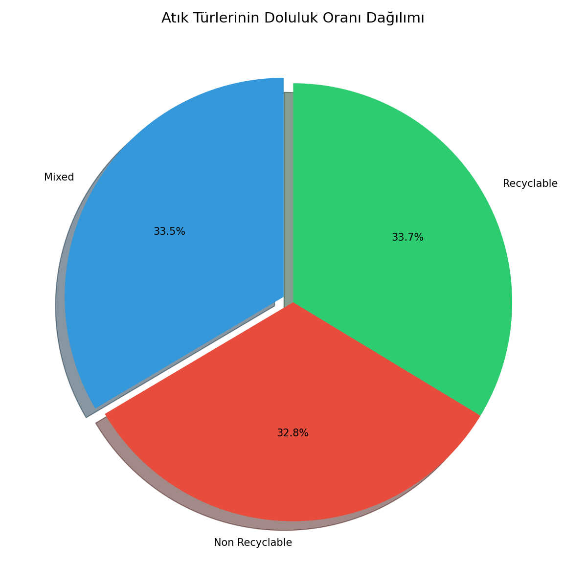
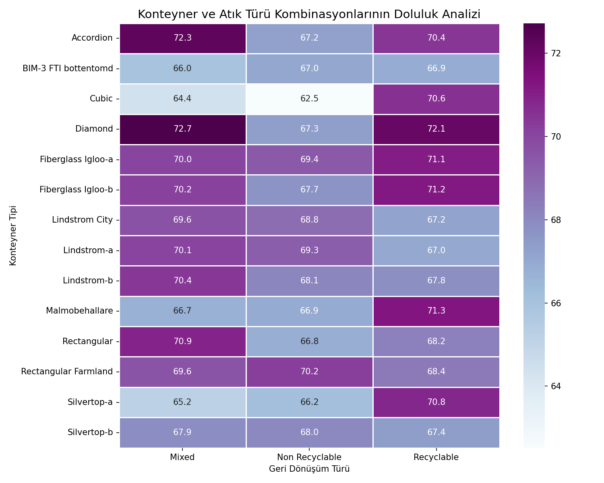
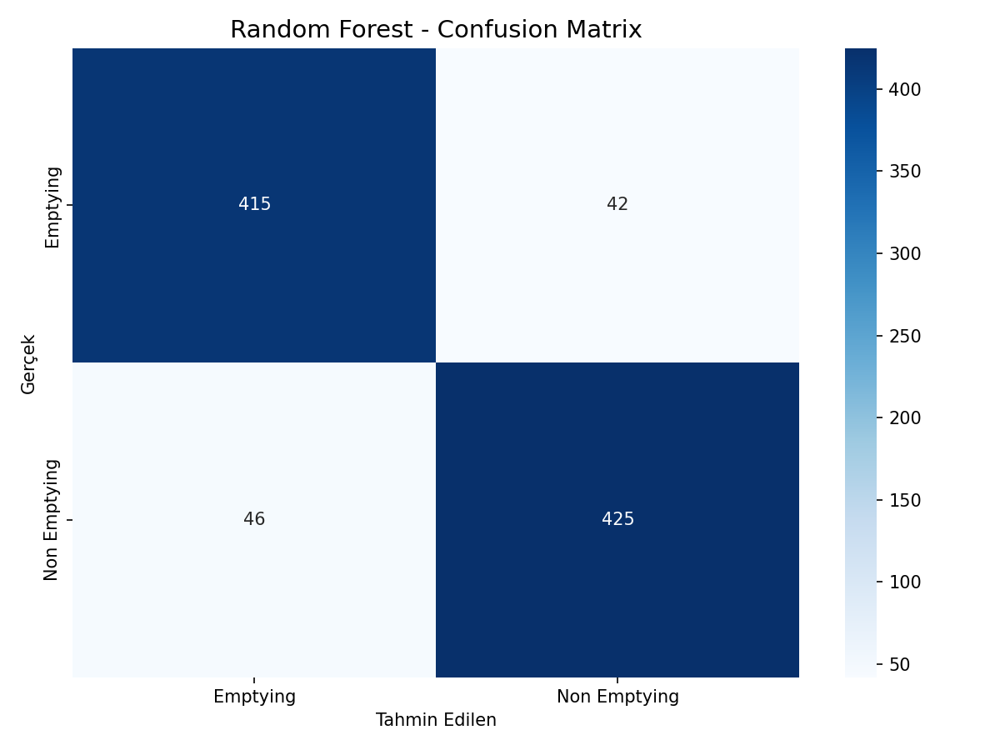
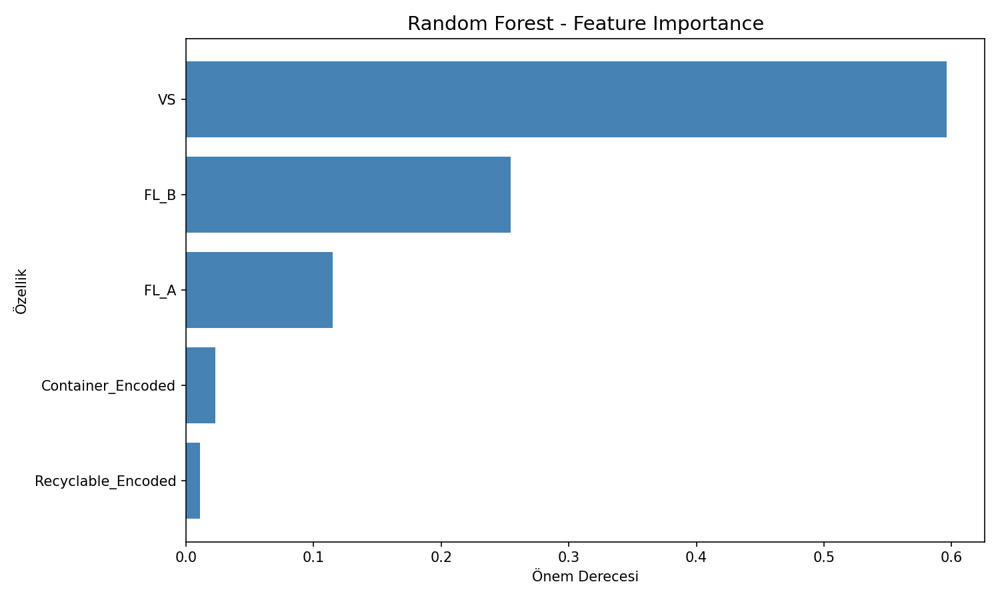

# Akıllı Çöp Kutusu Veri Analizi

Bu proje, akıllı çöp kutularından toplanan verilerin analiz edilmesini ve konteyner doluluk oranlarının incelenmesini içermektedir.

## Proje Hakkında

Akıllı çöp kutuları, atık yönetimi sistemlerinde verimliliği artırmak için kullanılan IoT tabanlı cihazlardır. Bu projede, farklı konteyner türleri ve atık kategorilerinin doluluk oranları analiz edilerek hangi kombinasyonların daha hızlı dolduğu tespit edilmiştir.

## Veri Seti

- Kayıt Sayısı: 4638
- Konteyner Türü: 14 farklı tip
- Atık Türü: Recyclable, Non Recyclable, Mixed

### Değişkenler

- FL_B: Doluluk oranı (sonra)
- FL_A: Doluluk oranı (önce)
- VS: Görsel skor
- Container Type: Konteyner türü
- Recyclable fraction: Atık türü
- Class: Boşaltma durumu (Emptying / Non Emptying)

## Kullanılan Teknolojiler

- pandas
- numpy
- matplotlib
- seaborn
- scikit-learn (RandomForestClassifier, LabelEncoder, KMeans)

## Yapılan Analizler

1. **Pivot Tablo Analizi:** Konteyner türü ve atık türü kombinasyonlarının ortalama doluluk oranları hesaplandı.

2. **Doluluk Değişimi:** FL_B - FL_A farkı hesaplanarak hangi kombinasyonların daha hızlı dolduğu belirlendi.

3. **Korelasyon Analizi:** Sayısal değişkenler arasındaki ilişkiler incelendi.

4. **Random Forest Sınıflandırma:** Class (Emptying/Non Emptying) tahmini için makine öğrenmesi modeli eğitildi.
   - Label Encoding ile kategorik değişkenler sayısala çevrildi
   - %80 eğitim, %20 test olarak veri bölündü

5. **K-Means Kümeleme:** Doluluk verilerine göre çöp kutuları 3 kümeye ayrıldı.

## Sonuçlar

- En hızlı dolan konteyner: Diamond (70.62)
- En yavaş dolan konteyner: Cubic (66.06)
- En hızlı dolan atık türü: Recyclable (69.31)
- Emptying sınıfı ortalama FL_B: 78.70
- Non Emptying sınıfı ortalama FL_B: 58.92

En Yüksek Doluluk Kombinasyonları:
1. Diamond + Mixed: 72.72
2. Accordion + Mixed: 72.28
3. Diamond + Recyclable: 72.08

## Dosyalar

- Smart_Bin.csv: Veri seti
- smart_bin_analiz.py: Python analiz kodu
- smart_bin_analiz.ipynb: Jupyter Notebook
- requirements.txt: Gerekli kütüphaneler

## Grafikler

### Konteyner Turune Gore Doluluk


### Atik Turu Dagilimi


### Sinif Bazinda Karsilastirma


### Pivot Tablo Isi Haritasi


### Random Forest Confusion Matrix


### Random Forest Feature Importance


## Kurulum

```
pip install -r requirements.txt
python smart_bin_analiz.py
```

## Sertifikalar

### Makine Ogrenmesi


### Python Programlama


## Lisans

Bu proje eğitim amaçlı hazırlanmıştır.
